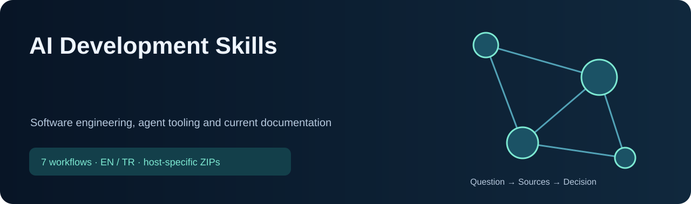

<!-- CURRENT-SKILL-PUBLICATION -->

# AI Development Skills

Software engineering, agent tooling and current documentation. These **7 workflows** help the assistant select tools, check evidence and produce reviewable results. They do not change model weights or guarantee better decisions.

 

**ChatGPT:** the button downloads a plugin with all listed skills and supporting files. Use the personal-plugin/skill import supported by your account. A single-skill ChatGPT button downloads a one-skill plugin. **Claude:** unpack the collection ZIP, then upload its individual skill ZIPs; the outer collection is not a single Claude skill. Local Codex/Claude Code files and cloud-account installation are separate.

Use natural English or Turkish requests. A slash-prefixed word typed in chat does not register a host command. Explicit local skill invocation uses the canonical skill name; available tools, network access and credentials remain host-dependent.

## Included skills

| Skill | What it solves / example request | ChatGPT | Claude |
|---|---|---|---|
| [`coding-workflow`](skills/common/coding-workflow/SKILL.md) | Debug, review, implement and verify software changes | [↓ ZIP](packages/chatgpt/coding-workflow.zip) | [↓ ZIP](packages/claude/coding-workflow.zip) |
| [`ai-agent-builder`](skills/common/ai-agent-builder/SKILL.md) | Create, audit and maintain skills, plugins and MCP integrations | [↓ ZIP](packages/chatgpt/ai-agent-builder.zip) | [↓ ZIP](packages/claude/ai-agent-builder.zip) |
| [`ai-research-skills`](skills/common/ai-research-skills/SKILL.md) | Develop research ideas, experiments and scientific writing | [↓ ZIP](packages/chatgpt/ai-research-skills.zip) | [↓ ZIP](packages/claude/ai-research-skills.zip) |
| [`context7-mcp`](skills/common/context7-mcp/SKILL.md) | Look up current library and API documentation with Context7 | [↓ ZIP](packages/chatgpt/context7-mcp.zip) | [↓ ZIP](packages/claude/context7-mcp.zip) |
| [`find-docs`](skills/common/find-docs/SKILL.md) | Find official SDK, CLI, framework and cloud documentation | [↓ ZIP](packages/chatgpt/find-docs.zip) | [↓ ZIP](packages/claude/find-docs.zip) |
| [`modern-web-guidance`](skills/common/modern-web-guidance/SKILL.md) | Check HTML/CSS/Web API support and progressive enhancement | [↓ ZIP](packages/chatgpt/modern-web-guidance.zip) | [↓ ZIP](packages/claude/modern-web-guidance.zip) |
| [`graphify`](skills/common/graphify/SKILL.md) | Map relationships across code, documents and research | [↓ ZIP](packages/chatgpt/graphify.zip) | [↓ ZIP](packages/claude/graphify.zip) |

## Installation and technical boundaries

- Full canonical sources: `skills/common/`; provider packages: `packages/chatgpt/`, `packages/claude/`, `packages/codex/`.
- Every Claude skill has at most 200 files and a description of at most 200 characters. ZIPs include all files of the selected provider source; `ai-research-skills` has a pre-existing cloud subset and a separate full local source.
- External services (Gemini, Parallel, Context7), local CLIs and subscriptions are not provided by these ZIPs. Report missing tools rather than simulating access.
- Validation checks package integrity, paths, descriptions, source/package parity and hashes. It is not a live account-installation test or a clinical/financial effectiveness claim.
- See [checksums](downloads/SHA256SUMS.txt), [provenance](PUBLICATION.md), and [third-party notices](THIRD_PARTY_NOTICES.md). Existing license and copyright files retain their scope; there is no blanket license grant over third-party content.

[AI research security repair / Güvenlik düzeltmesi](AI-RESEARCH-SECURITY.md): 98 local / 10 cloud modules retained; explicit scope, privacy and permission boundaries.

<!-- END-CURRENT-SKILL-PUBLICATION -->

